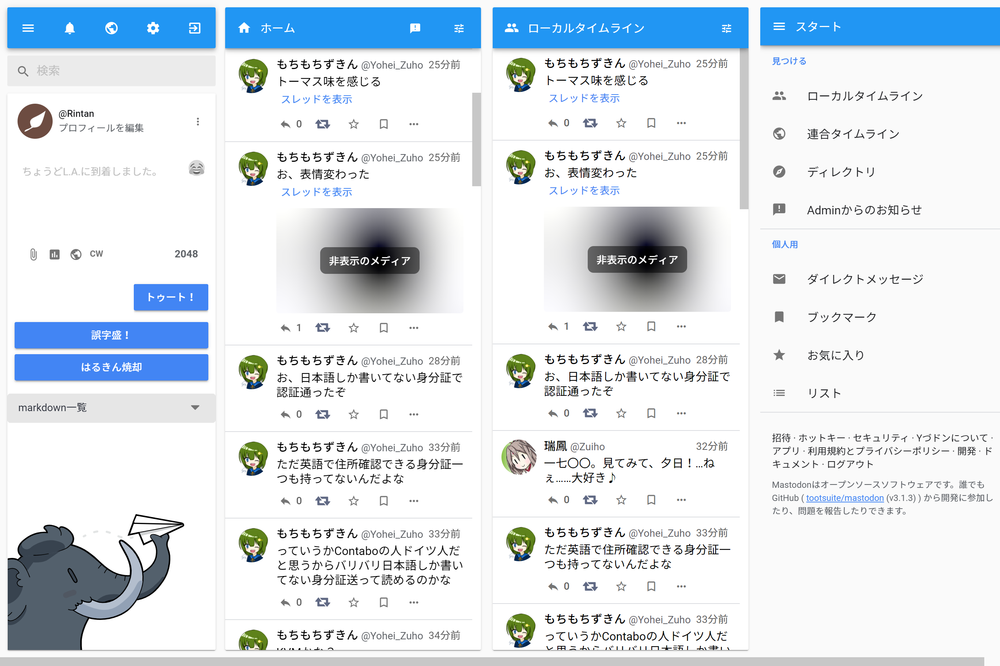
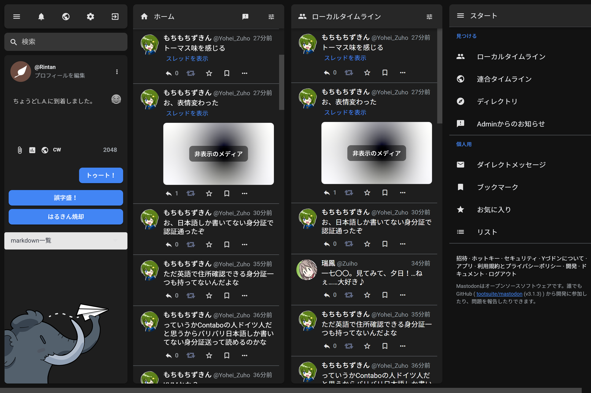

# Mastodon Material

## Language | 言語

[日本語 (Japanese)](README_ja.md)

## Overview

Mastodon Material is the native theme for Mastodon, which based on [Material Design](https://material.io). Development policy is [here (Japanese)](docs/development_policy_ja.md).

> Note: This theme is now beta version. Many features may not be implemented or not work properly. 

## Requirement

- [Mastodon](https://github.com/tootsuite/mastodon) v3.0 or above
- [Sass](https://sass-lang.com) 1.25.x

## Installation

1. Copy these files of this repository into `app/javascript/styles` of Mastodon source directory.
   
   * `/src/mastodon-material/`
   * `/src/mastodon-material.scss`

2. Add the below code on `config/themes.yml` 
   
   ```yml
   default: styles/application.scss
   contrast: styles/contrast.scss
   mastodon-light: styles/mastodon-light.scss
   
   # Additional theme
   mastodon-material: styles/mastodon-material.scss # add this line
   ```

3. If you want to change the display theme name in your language, add localization strings to `config/locales/{lang}.yml` like below (At least `config/locales/en.yml` is **REQUIRED**)
   
   ```yml
   themes:
    contrast: High contrast
    default: Mastodon
    mastodon-light: Mastodon (light)
   
    # Additional theme
    mastodon-material: Mastodon Material # add this line
   ```

4. If you configure to use the webfont on GitHub (default) or on Google Fonts, you need to add an exception to *CSP (Content Security Policy)*. Make sure to change `config/initializers/content_security_policy.rb` :
   
   ```ruby
   def host_to_url(str)
    "http#{Rails.configuration.x.use_https ? 's' : ''}://#{str}" unless str.blank?
   end
   base_host = Rails.configuration.x.web_domain
   assets_host = Rails.configuration.action_controller.asset_host
   assets_host ||= host_to_url(base_host)
   media_host = host_to_url(ENV['S3_ALIAS_HOST'])
   media_host ||= host_to_url(ENV['S3_CLOUDFRONT_HOST'])
   media_host ||= host_to_url(ENV['S3_HOSTNAME']) if ENV['S3_ENABLED'] == 'true'
   media_host ||= assets_host
   Rails.application.config.content_security_policy do |p|
    p.base_uri :none
    p.default_src :none
    p.frame_ancestors :none
    p.font_src :self, assets_host
    p.img_src :self, :https, :data, :blob, assets_host
    p.style_src :self, :unsafe_inline, assets_host
    p.media_src :self, :https, :data, assets_host
    p.frame_src :self, :https
    p.manifest_src :self, assets_host
   ```
   
   into
   
   ```ruby
   def host_to_url(str)
    "http#{Rails.configuration.x.use_https ? 's' : ''}://#{str}" unless str.blank?
   end
   base_host = Rails.configuration.x.web_domain
   assets_host = Rails.configuration.action_controller.asset_host
   assets_host ||= host_to_url(base_host)
   media_host = host_to_url(ENV['S3_ALIAS_HOST'])
   media_host ||= host_to_url(ENV['S3_CLOUDFRONT_HOST'])
   media_host ||= host_to_url(ENV['S3_HOSTNAME']) if ENV['S3_ENABLED'] == 'true'
   media_host ||= assets_host
   # custom host
   github_host = "https://raw.githubusercontent.com" # GitHub
   google_fonts_host = "https://fonts.gstatic.com" # Google Fonts
   Rails.application.config.content_security_policy do |p|
    p.base_uri :none
    p.default_src :none
    p.frame_ancestors :none
    p.font_src :self, assets_host, github_host, google_fonts_host
    p.img_src :self, :https, :data, :blob, assets_host
    p.style_src :self, :unsafe_inline, assets_host
    p.media_src :self, :https, :data, assets_host
    p.frame_src :self, :https
    p.manifest_src :self, assets_host
   ```

## Customization

[Customization Guide](docs/customization_guide.md)

## Stylish/Stylus theme

You can use our theme on any server by the browser extension, [Stylish](https://userstyles.org/) or [Stylus](https://add0n.com/stylus.html).

## License

This theme and the Stylish/Stylus theme can be used under [AGPL-3.0](LICENSE). [Material Icons font](https://google.github.io/material-design-icons/#icon-font-for-the-web) is available under [Apache license version 2.0](https://www.apache.org/licenses/LICENSE-2.0.html). (This repository does not include Material Icons font.)

## Screenshot



