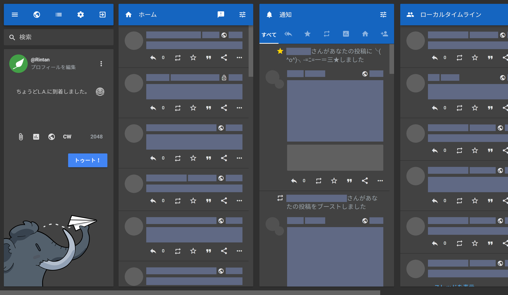
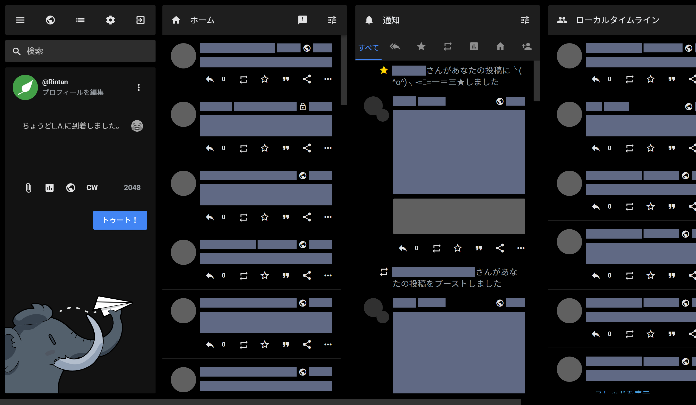
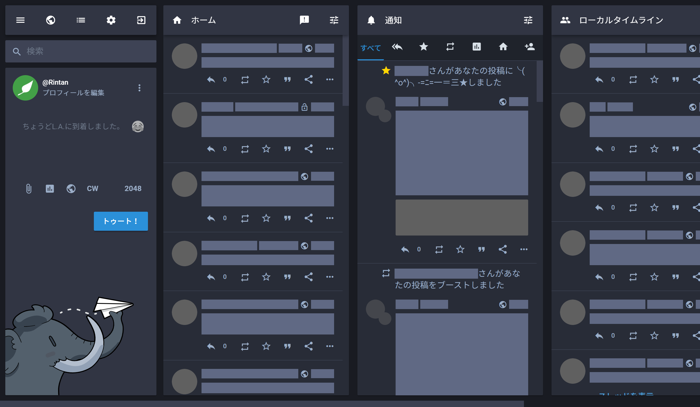

# Mastodon Material

## Language | 言語

[日本語 (Japanese)](README_ja.md)

## Overview

Mastodon Material is the native theme for Mastodon, which based on [Material Design](https://material.io). Development policy is [here (Japanese)](docs/development_policy_ja.md).

## Screenshots

show/hide

v1-light + material-v1

v1-dark + material-v1

black + material-v1

v2-light + material-v2

v2-dark + material-v2

mastodon-light + material-v1

mastodon-dark + material-v1

## Requirement

- [Mastodon](https://github.com/tootsuite/mastodon) v3.1 or above
- [Sass](https://sass-lang.com) 1.25.x

## How to install

[Installation Guide](docs/installation_guide.md)

## Customization

[Customization Guide](docs/customization_guide.md)

## Stylus/Stylish theme

You can use our theme on any server by the browser extension, [Stylus](https://add0n.com/stylus.html) or [Stylish](https://userstyles.org/).

- **Build by yourself**
  
  1. Install [Sass](https://sass-lang.com) on your computer. Require version is refered in [Requirement](#Requirement).
  2. Clone or download this repository on your computer.
  3. If you want to customize, please read [Customization Guide](docs/customization_guide.md).
  4. Run [build.bat (Windows)](build/build.bat) or [build.sh (macOS/Linux)](build/build.sh). Results will be output in [build.css](build/build.css).
  5. Make a new theme on Stylus or Stylish, copy the code of [build.css](build/build.css) and paste on it. Add your favorite server domain on it and save/enable it.

## License

This theme and the Stylish/Stylus theme can be used under [AGPL-3.0](LICENSE). [Material Icons font](https://google.github.io/material-design-icons/#icon-font-for-the-web) is available under [Apache license version 2.0](https://www.apache.org/licenses/LICENSE-2.0.html). (This repository does not include Material Icons font.)

[The header image](docs/src/top.png) was made by using [Noto Sans](https://www.google.com/get/noto/#sans-lgc) and [mastodon.privacyfilter.user.styl](https://github.com/eai04191/userscript-graveyard#mastodonprivacyfilteruserstyl).
