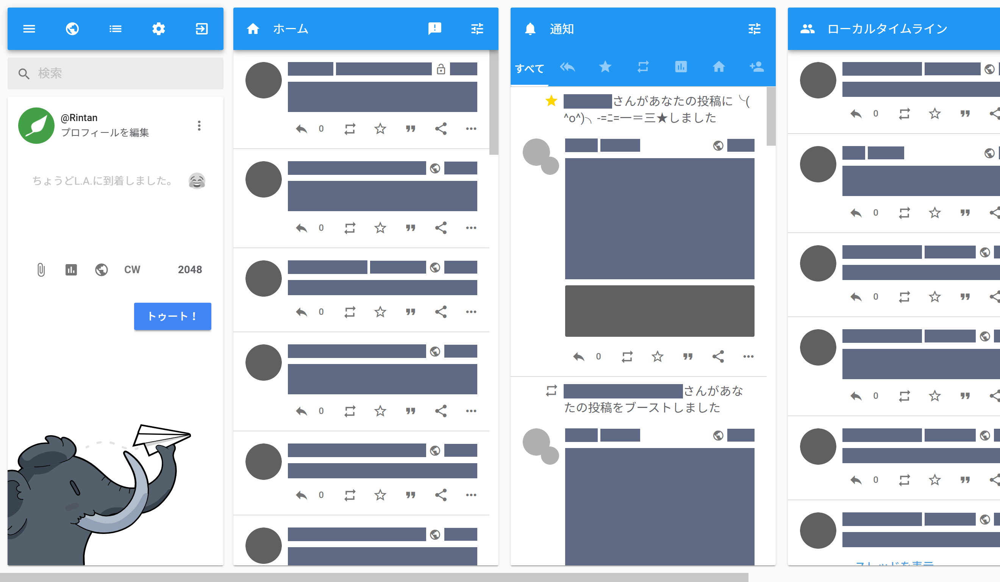
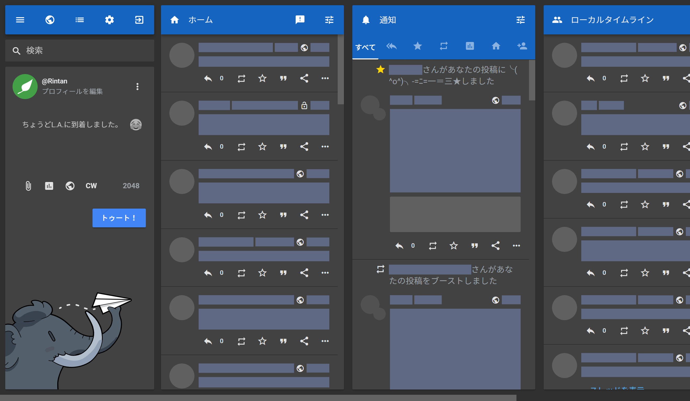
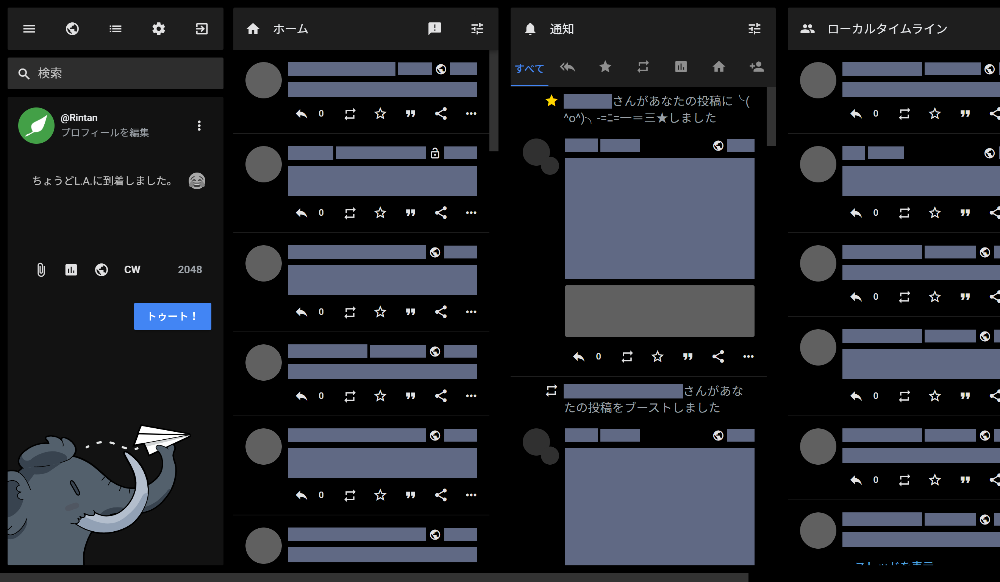
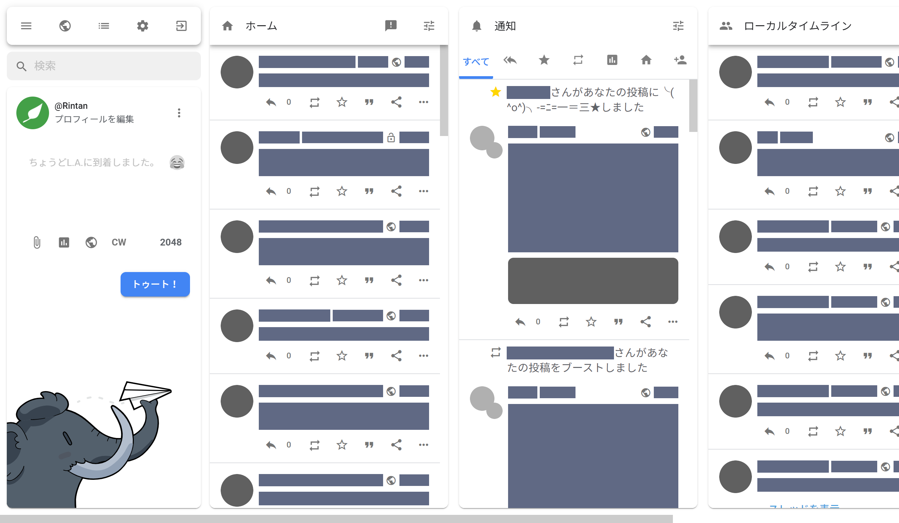
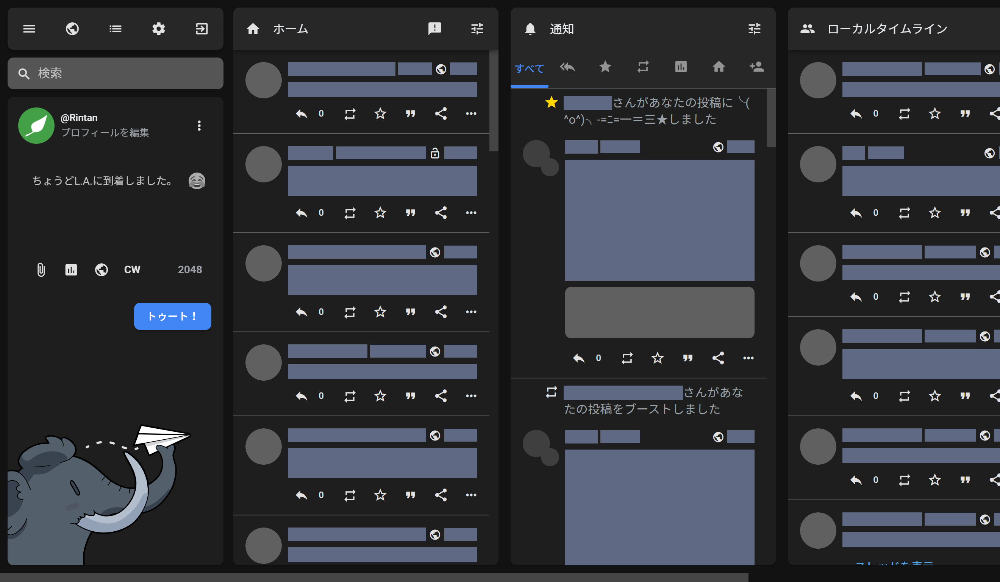
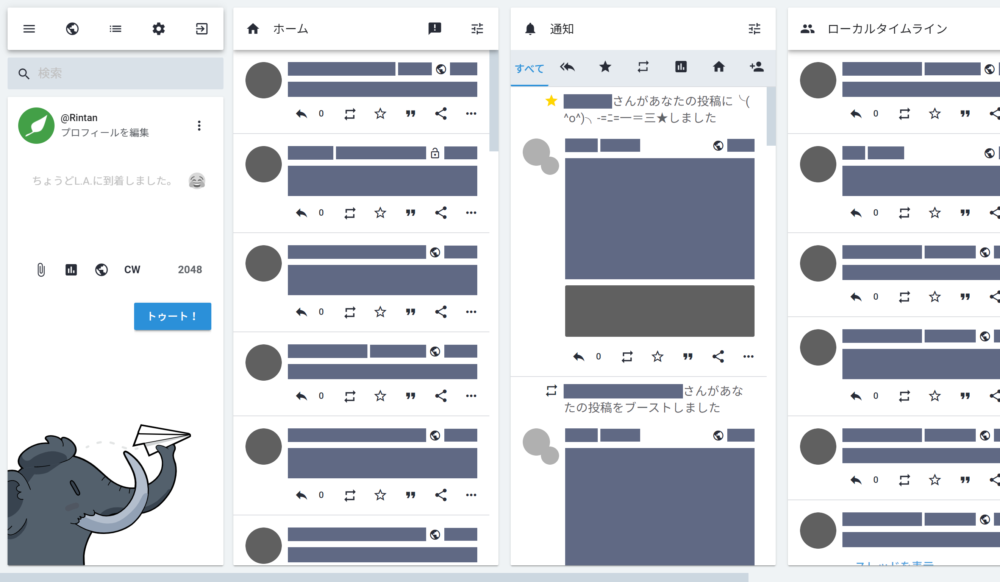
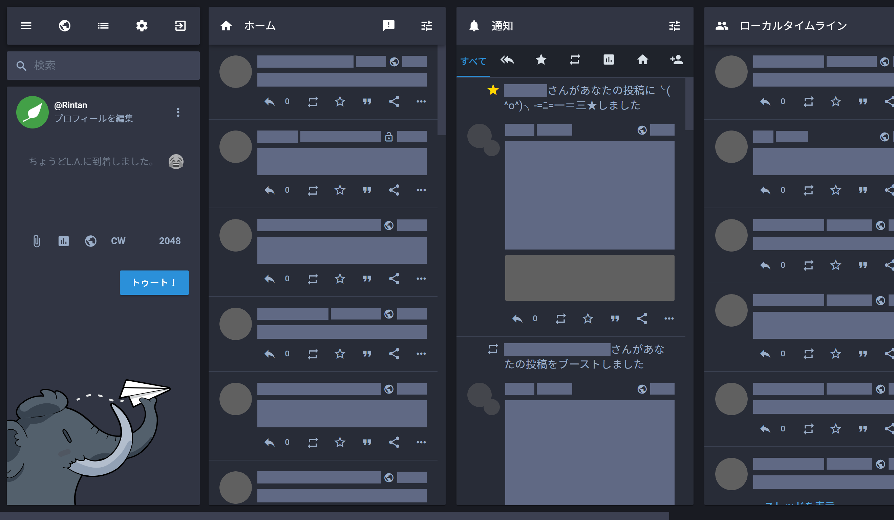

# Mastodon Material

## 言語 | Language

[English (英語)](README.md)

## 概要

Mastodon Materialは、[Material Design](https://material.io)準拠のMastodon向けネイティブテーマです。開発方針は[こちら](docs/development_policy_ja.md)

## スクリーンショット

表示/非表示

v1-light + material-v1

v1-dark + material-v1

black + material-v1

v2-light + material-v2

v2-dark + material-v2

mastodon-light + material-v1

mastodon-dark + material-v1

## 動作環境

- [Mastodon](https://github.com/tootsuite/mastodon) v3.1以上
- [Sass](https://sass-lang.com) 1.25.0以上

## インストール

[インストールガイド](docs/installation_guide_ja.md)

## カスタマイズ

[カスタマイズガイド](docs/customization_guide_ja.md)

## Stylus/Stylishテーマ

任意のサーバーでもこのテーマを利用できるよう、ブラウザ拡張機能の[Stylus](https://add0n.com/stylus.html)や[Stylish](https://userstyles.org/)向けのテーマを公開しています。

- **自分でビルドする**
  
  1. [Sass](https://sass-lang.com)を導入します。バージョンは[動作環境](#動作環境)を参照してください。
  2. このリポジトリをクローンまたはダウンロードしてください。
  3. カスタマイズする場合、[カスタマイズガイド](docs/customization_guide_ja.md)を参照してください。
  4. [build.bat (Windows)](build/build.bat)または[build.sh (macOS/Linux)](build/build.sh)を実行してください。結果が[build.css](build/build.css)に出力されます。
  5. StylusまたはStylishでテーマを新規作成し、[build.css](build/build.css)の内容をコピペします。利用しているサーバーのドメインを追加して、テーマを保存/有効化してください。

## ライセンス

このテーマ及びStylish/Stylus版テーマは[AGPL-3.0](LICENSE)に基づいて公開されています。また、Google製[Material Iconsフォント](https://google.github.io/material-design-icons/#icon-font-for-the-web)については、[Apache license version 2.0](https://www.apache.org/licenses/LICENSE-2.0.html)で提供されています。(このリポジトリにMaterial Iconsフォントファイルは含まれていません)

[ヘッダー画像](docs/src/top.png)は[Noto Sans](https://www.google.com/get/noto/#sans-lgc)と[mastodon.privacyfilter.user.styl](https://github.com/eai04191/userscript-graveyard#mastodonprivacyfilteruserstyl)を使用して作りました。
