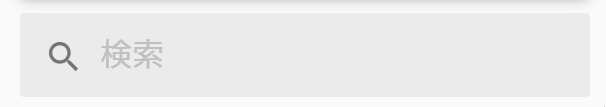

# Customization Guide

## Language | 言語
[日本語(Japanese)](customization_guide_ja.md)

## Note
These customizations are needed to modify source code. So, you need a permission to modify them.

## Profiles
Plugins, settings and any other customizations are stored as profiles. It can behave as multiple themes by switching profiles. The default profile is [`default`](../src/mastodon-material/profiles/default).

## Create new profiles
1. Duplicate [`default`](../src/mastodon-material/profiles/default) folder and change its name. The new folder name is called {profile_name} in this document.
2. Duplicate [`mastodon-material.scss`](../src/mastodon-material.scss) and change its name to `{profile_name}.scss`. Confirm `{profile_name}.scss` is located in `app/javascript/styles`, Mastodon source directory as you installed this theme.
3. Open `{profile_name}.scss` and change `@import 'mastodon-material/profiles/default/loader';` into `@import 'mastodon-material/profiles/{profile_name}/loader';`.
4. Also refer [README.md](../README.md#How-to-install) to continue. Configure the new profile like below by editing `config/themes.yml`.
  ```yml
  default: styles/application.scss
  contrast: styles/contrast.scss
  mastodon-light: styles/mastodon-light.scss
  
  # Added theme
  mastodon-material: styles/mastodon-material.scss
  {profile_name}: styles/{profile_name}.scss # add this line
  ```
5. If you want to change the display theme name in your language, add localization strings to `config/locales/{lang}.yml` like below (At least `config/locales/en.yml` is **REQUIRED**)
  ```yml
  themes:
   contrast: High contrast
   default: Mastodon
   mastodon-light: Mastodon (light)
  
  # Added theme
   mastodon-material: Mastodon Material
   {profile_name}: {display_name} # add this line
  ```

## Basic Settings
Please make reference to [`mastodon-material/theme/base_config.scss`](../src/mastodon-material/theme/base_config.scss) and write your change in `mastodon-material/profiles/{profile_name}/config.scss`. **DO NOT** edit [`base_config.scss`](../src/mastodon-material/theme/base_config.scss).

### Color and layout presets
There are two types of profiles, color presets and layout presets. Default color preset is `v1-light` and layout preset is `material-v1`. You can configure them by using `@import`.

### Float search bar when cursor hovers


Search bar floats when cursor hovers (mouseover operation) and changes the background color into focusing one. Add `$search-bar-hover: true;`.

### Change font size
You can change font size of statuses body and display name. Set `$status-font-size` value to change font size of statuses contents and `$name-font-size` value to change of display name.

### Set background image
You can set a background image by `$bg-image` value. You should use relative path or URL and bracket it.

### Change transparency
You can change transparency of some elements. Change top bar and column transparency by setting `$bar-transparency` and `$column-transparency` value. Set a value between 0 and 1. 1 is opacity and 0 is transparent.

## Icon settings
Please make reference to [`mastodon-material/theme/base_icon_config.scss`](../src/mastodon-material/theme/base_icon_config.scss) and write your change in `mastodon-material/profiles/{profile_name}/icon_config.scss`. **DO NOT** edit [`base_icon_config.scss`](../src/mastodon-material/theme/base_icon_config.scss).

### Change icon fonts host
The default setting loads the icon fonts on Google Fonts.

- **Use the font on GitHub (Unrecommended)**
  Add `$icon-font-source: github;`.

- **Host the font on your server**
  
  Add `$icon-font-source: self;`. Then, download font file from [official font repository](https://github.com/google/material-design-icons/tree/master/font) and put the font file into `/app/javascript/fonts`, Mastodon source directory.

### Change icon fonts style
The icon fonts have 5 styles, Filled, Outlined, Rounded, Two-Tone and Sharp. You can check how they look in [Icons - Material Design](https://material.io/resources/icons/). Edit `// Material Icon style settings` section to change it. The default style is Filled.

## Plugins
Uncomment what you want to enable in `mastodon-material/profiles/{profile_name}/loader.scss`.

### Display statuses on timeline in a card style
Change a default list style statuses in timeline into a card one. If you enable it, the less information are displayed in a card style than in a list one in a same density.

Uncomment `@import 'plugins/cards';` to enable it.

### Improve the browseability
This theme based on Material Design Guideline strictly, the less information are displayed by the default settings than the mastodon default ones in a same density. This plugin (dense plugin) can make the information displayed more by ignoring the guideline.

Uncomment `@import 'plugins/dense';` to enable it.

## (etc) Disable the material design icon font
This theme use [Material Icons Font](https://google.github.io/material-design-icons/#icon-font-for-the-web) by Google to display Material Design icon. If you have some problem about license, you can use [Font Awesome](https://fontawesome.com/), default icon font without any bad effect on other UI in this theme.

Open `mastodon-material/profiles/{profile_name}/loader.scss` and comment out `@import 'theme/material-icons';` to disable it.
