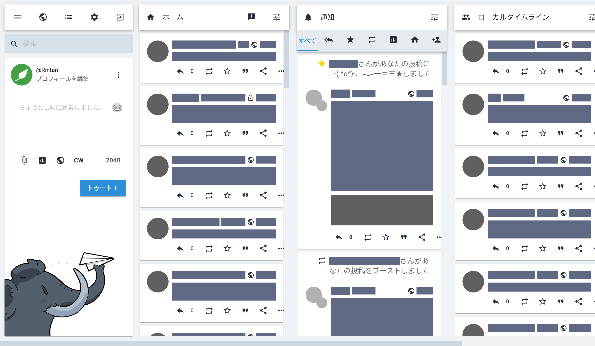
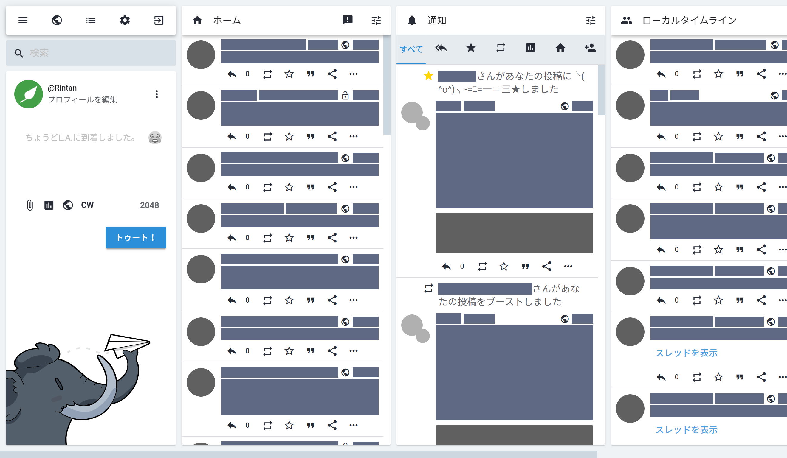

# Customization Guide

## Language | 言語

[日本語(Japanese)](customization_guide_ja.md)

## Color and layout presets

There are two types of profiles, color presets to set color schemes and layout presets.  
You can configure color preset to edit the reference in `@forward '../color/v1-light'` in [`mastodon-material/config/_config_color.scss`](../src/mastodon-material/config/_config_color.scss).  
You can configure layout preset to edit the reference in `@forward '../layout/material-v1'` in [`mastodon-material/config/_config_layout.scss`](../src/mastodon-material/config/_config_layout.scss).

## Basic Settings

Please make reference to a base file, [`mastodon-material/theme/_config_basic.scss`](../src/mastodon-material/theme/_config_basic_.scss), and write your change in [`mastodon-material/config/_config_basic.scss`](../src/mastodon-material/config/_config_basic.scss). **DO NOT** edit the base file.

### Float search bar when cursor hovers

`$search-bar-hover: true,`

Search bar floats when cursor hovers (mouseover operation) and changes the background color into focusing one. To enable it, add `$search-bar-hover: true,`.  
Default: `$search-bar-hover: false,`

### Change font size

You can change font size of statuses body and display name. Set `$status-font-size` value to change font size of statuses contents and `$name-font-size` value to change of display name.  
Default:  
`$status-font-size: 15px,`  
`$name-font-size: 15px,`

### Set background image

You can set a background image by `$bg-image` value. You should use relative path or URL and bracket it by `""`.  
Default: `$bg-image: none,`

### Change transparency

You can change transparency of some elements. Change top bar and column transparency by setting `$bar-transparency` and `$column-transparency` value. Set a value between 0 and 1. 1 is opacity and 0 is transparent.  
Default:  
`$bar-transparency: 1,`  
`$column-transparency: 1,`

### Change icon fonts host

The default setting loads the icon fonts on Google Fonts.

- **Use the font on GitHub repository (Unrecommended)**
  
  Add `$icon-font-source: github,`.

- **Host the font on your server**
  
  Add `$icon-font-source: self,`. Then, download font file from [official font repository](https://github.com/google/material-design-icons/tree/master/font) and put the font file into `/app/javascript/fonts`, Mastodon source directory.

### Change icon fonts style

The icon fonts have 5 styles, Filled, Outlined, Rounded, Two-Tone and Sharp. You can check how they look in [Material Symbols and Icons - Google Fonts](https://fonts.google.com/icons). Edit `// Material Icon style settings` section to change it. The default style is Filled.

## Plugins

Uncomment what you want to enable in [`mastodon-material/_index.scss`](../src/mastodon-material/_index.scss).  
Check other resources in [this page](https://github.com/GenbuProject/Mastodon-Material-Gallery).

### Display statuses on timeline in a card style

Change a default list style statuses in timeline into a card one. If you enable it, the less information are displayed in a card style than in a list one in a same density.

Uncomment `@use 'plugins/cards';` to enable it.

show/hide screenshots

### Improve the browseability

This theme based on Material Design Guideline strictly, the less information are displayed by the default settings than the mastodon default ones in a same density. Dense plugin can make the information displayed more by ignoring the guideline.

Uncomment `@use 'plugins/dense';` to enable it.

show/hide screenshots

Default

Dense

## Disable the material design icon font (Unrecommended)

This theme use [Material Icons Font](https://fonts.google.com/icons) by Google to display Material Design icon. If you have some problem about license, you can use [Font Awesome](https://fontawesome.com/), default icon font without any bad effect on other UI in this theme.

Open [`mastodon-material/theme/_icons-loader.scss`](../src/mastodon-material/theme/_icons-loader.scss) and comment out `@forward 'material-icons';` to disable it.
